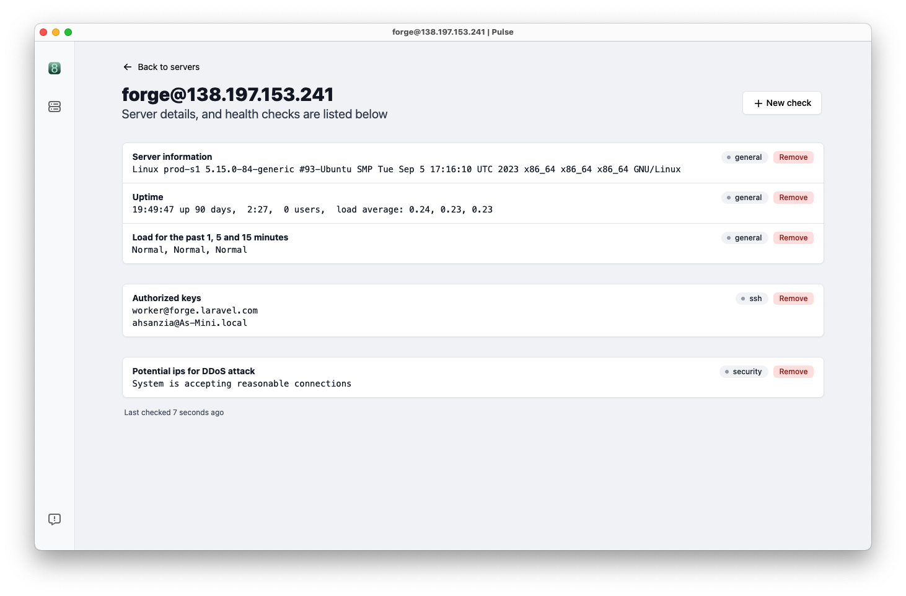

### About Pulse
Server checks, and monitoring with Pulse

Pulse Desktop is a desktop app that helps you monitor your server health, and performance. Create your own custom checks, and stay updated with the server health.

#### Installation

Some basic requirements for SNS Desktop.
- MacOS
- Activation Key

##### Found bug or have a request
If you have feature or issues 🐞 please add them here. We're working on adding some new features and service providers as well.
